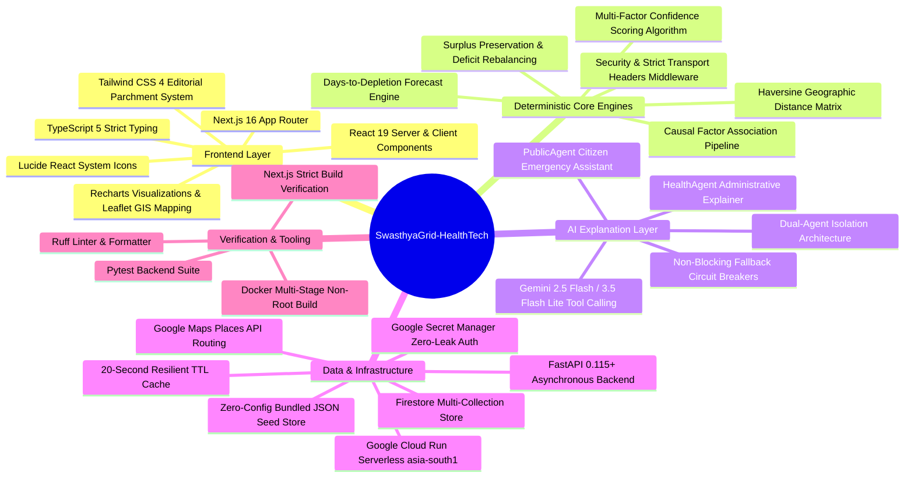
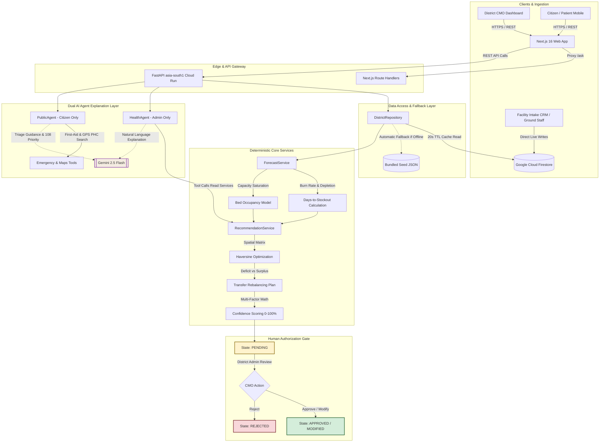
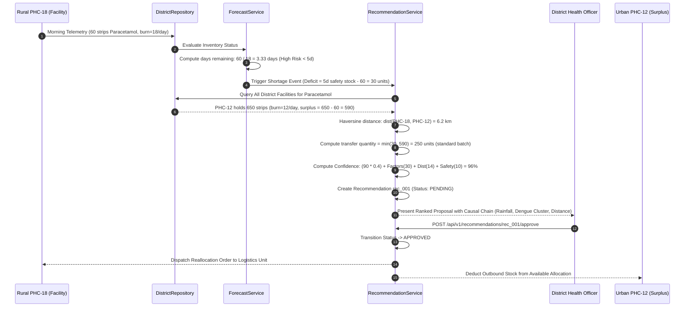
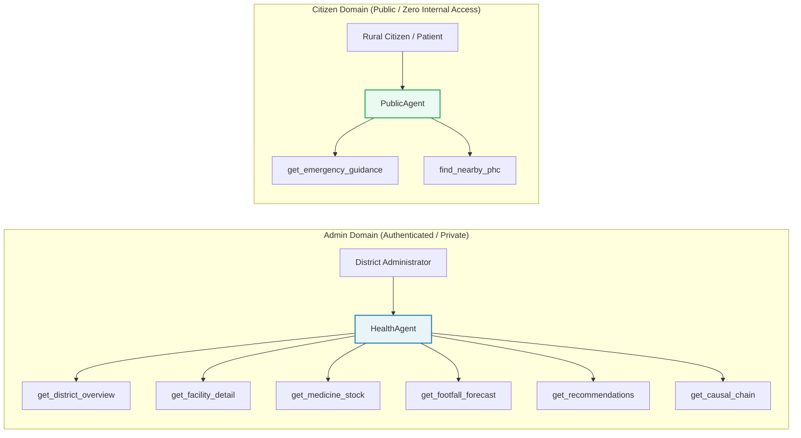

<div align="center">

# SwasthyaGrid-HealthTech

*Predictive district health operations, real-time resource reallocation, explainable risk modeling, and emergency triage for public healthcare.*

[](https://swasthyagrid.vercel.app)
[](https://swasthyagrid-api-616415200021.asia-south1.run.app/docs)
[](#-testing-and-evaluation)
[](LICENSE)

[](https://fastapi.tiangolo.com)
[](https://nextjs.org)
[](https://www.typescriptlang.org)
[](https://www.python.org)
[](https://firebase.google.com/docs/firestore)
[](https://ai.google.dev)

[The crisis](#-the-claim-this-is-built-on) &middot;
[One unified grid](#-one-unified-grid-not-disconnected-tools) &middot;
[Stack map](#-a-map-of-the-stack) &middot;
[Technology cards](#-technology-cards) &middot;
[Architecture](#-architecture) &middot;
[The reallocation loop](#-the-reallocation-loop-visualised) &middot;
[Dual-agent security](#-dual-agent-isolation--security) &middot;
[Backend deep-dive](#-backend-deep-dive) &middot;
[Evaluation](#-testing-and-evaluation) &middot;
[Run locally](#-running-it-locally) &middot;
[Deterministic vs AI](#-what-this-system-decides-what-it-merely-proposes)

</div>

---

## 🩺 The claim this is built on

Across India's public healthcare grid, more than **25,000 Primary Health Centres (PHCs)** and **5,600 Community Health Centres (CHCs)** deliver frontline medical care to over 800 million citizens. In practice, operational telemetry across these facilities lives in fragmented paper registers, disparate spreadsheets, and delayed monthly summaries.

When a rural PHC experiences an unpredicted surge in acute gastroenteritis or dengue, or when essential life-saving stocks—such as **Anti-Snake Venom (ASV)**, **Anti-Rabies Vaccine (ARV)**, **Oxytocin**, or **Adrenaline**—reach zero, the Chief Medical Officer (CMO) at the district headquarters typically discovers the crisis **3 to 7 days after stock depletion**. Simultaneously, a sibling PHC merely 12 kilometers away often holds a 45-day surplus of the exact same medication, decaying toward expiration.

Legacy health management information systems (HMIS) function strictly as post-facto audit tools: they record what went wrong last month. They do not forecast tomorrow's depletion, they do not calculate optimal geographic redistribution vectors, and they leave rural citizens stranded without real-time triage or functional facility routing.

> Everyone else builds static historical dashboards or generic conversational wrappers. SwasthyaGrid calculates stock burn rates and bed saturation curves 3 to 7 days into the future, optimizes inter-facility transfer vectors via Haversine logistics modeling, and enforces strict human-in-the-loop authorization before a single vial or doctor is moved.

---

## 🔄 One unified grid, not disconnected tools

A district health administrative team and the rural population they protect operate in interdependent operational loops. SwasthyaGrid unifies both operational command and public triage into a single continuous intelligence pipeline:

1. **Predictive Medicine Inventory & Depletion Forecasting** (`/inventory`, `/overview`): Continuously computes days-to-zero per drug based on historical daily burn rates multiplied by environmental risk multipliers (e.g., rainfall, dengue clusters, heatwaves). Automatically flags high-risk depletion ($< 3\text{ days}$) before stock-outs occur.
2. **Dynamic Bed Capacity & Maternity Triage** (`/beds`): Forecasts occupancy rates across general and maternity wards 24 hours and 7 days ahead. Triggers automated sibling facility redirection proposals whenever a facility breaches the $90\%$ capacity threshold.
3. **Staff Attendance & Provider Risk Detection** (`/doctors`): Analyzes longitudinal attendance patterns (such as recurrent single-day absence cycles), computes downstream patient delay impact percentages, and surfaces temporary rotation recommendations from facilities with surplus staffing capacity.
4. **Diagnostic Equipment Audit & Failover Routing** (`/diagnostics`): Monitors active lab machines and diagnostic units (e.g., X-Ray, CBC analyzers). On machine failure, it immediately resolves the nearest operational alternative facility by road distance.
5. **Human-Governed Prescription & Reallocation Engine** (`/recommendations`): Converts raw statistical risk into ranked, actionable transfer orders (`[Approve]`, `[Modify]`, `[Reject]`) equipped with mathematical confidence scores and explicit causal factor breakdowns.
6. **Citizen Emergency Triage & Real-Time Facility Locator** (`/citizen`): Dedicated, security-isolated public portal offering instant, deterministic 108 emergency triage protocols and live GPS-based nearest functional PHC locator backed by Google Maps Places API.

---

## 🧠 A map of the stack

A complete map of every core dependency and subsystem in the repository, organized by operational responsibility:



---

## 🗂️ Technology cards

Every technology card below references concrete files and subsystems within this codebase:

| Technology | Architectural Role | Codebase Location |
| :--- | :--- | :--- |
| **FastAPI 0.115+ (Python 3.12)** | Asynchronous REST backend, strict Pydantic DTO schemas, domain exception hierarchies, and dependency injection container | [`backend/app/main.py`](file:///backend/app/main.py), [`backend/app/api/v1/routes.py`](file:///backend/app/api/v1/routes.py) |
| **Next.js 16 (App Router)** | Server-rendered command dashboards, route-level data streaming, and edge API proxies | [`frontend/src/app/`](file:///frontend/src/app/), [`frontend/src/app/(dashboard)/layout.tsx`](file:///frontend/src/app/(dashboard)/layout.tsx) |
| **React 19 & TypeScript 5** | Reactive dashboard widgets, dynamic approval modals, interactive Leaflet maps, and shared district type definitions | [`frontend/src/data/district.ts`](file:///frontend/src/data/district.ts), [`frontend/src/app/(dashboard)/map/`](file:///frontend/src/app/(dashboard)/map/) |
| **Tailwind CSS 4** | High-density editorial design system with bespoke warm parchment tones (`#FDFBF7`, `#1A2E26`, `#B5502E`), avoiding generic SaaS aesthetics | [`frontend/src/app/globals.css`](file:///frontend/src/app/globals.css) |
| **Forecast Engine** | Pure mathematical risk computation: burn rate analysis, safety-stock floors, and risk tier categorization | [`backend/app/services/forecast_service.py`](file:///backend/app/services/forecast_service.py) |
| **Recommendation Engine** | Spatial surplus discovery via Haversine distance, transfer quantity optimization, and multi-factor confidence scoring | [`backend/app/services/recommendation_service.py`](file:///backend/app/services/recommendation_service.py) |
| **Resilient Repository Pattern** | Dual-mode persistence: live Firestore sync with 20s TTL caching and zero-dependency JSON fallback | [`backend/app/repositories/district_repository.py`](file:///backend/app/repositories/district_repository.py) |
| **Dual Gemini Agents** | Isolated tool-calling agents (`HealthAgent` for admin diagnostics, `PublicAgent` for citizen first-aid) using `google-genai` | [`backend/app/agents/health_agent.py`](file:///backend/app/agents/health_agent.py), [`backend/app/agents/public_agent.py`](file:///backend/app/agents/public_agent.py) |
| **Emergency & GIS Tools** | Deterministic life-threatening condition detector, national helpline director (108/104/112), and Maps Places integration | [`backend/app/tools/emergency_tool.py`](file:///backend/app/tools/emergency_tool.py), [`backend/app/tools/maps_tool.py`](file:///backend/app/tools/maps_tool.py) |
| **Google Cloud Run & Vercel** | Containerized serverless deployment in `asia-south1` with runtime secret injection via Google Secret Manager | [`backend/Dockerfile`](file:///backend/Dockerfile), [`vercel.json`](file:///vercel.json) |

---

## 🏗️ Architecture

The end-to-end request lifecycle enforces a strict separation between deterministic business computation and probabilistic AI explanation:



---

## ⏱️ The reallocation loop, visualised

How SwasthyaGrid detects a critical drug shortage, computes a mathematically optimal inter-facility transfer across rural coordinates, and locks the proposal in pending status until approved:



---

## 🔒 Dual-agent isolation & security

Public healthcare systems handle both sensitive administrative logistics and vulnerable public citizen queries. SwasthyaGrid implements strict architectural isolation between administrative operations and public interactions:



### Security Boundaries
1. **Tool Access Partitioning**: The `PublicAgent` has **zero programmatic access** to internal district inventory, doctor attendance records, bed vacancy logs, or administrative metrics. It cannot query or leak operational state.
2. **Deterministic Emergency Preemption**: If a citizen query matches life-threatening keywords (e.g., *chest pain*, *snake bite*, *severe haemorrhage*, *unconscious*), the system instantly prepends mandatory **🚨 EMERGENCY — Call 108 immediately** directives and executes clinical first-aid routines without delegating triage judgment to an ungrounded model.
3. **Zero Hardcoded Secrets**: All runtime credentials (`GEMINI_API_KEY`, `GOOGLE_MAPS_API_KEY`, `FIRESTORE_*`) are resolved at container startup from **Google Secret Manager** or injected as encrypted environment variables in production.

---

## ⚙️ Backend deep-dive

### 1. Resilient Dual-Source Persistence (`DistrictRepository`)
The repository layer ([`backend/app/repositories/district_repository.py`](file:///backend/app/repositories/district_repository.py)) provides uninterrupted operational uptime:
- **Primary Source**: Connects to Google Cloud Firestore collections (`facilities`, `medicine_stock`, `beds`, `doctors`, `diagnostics`).
- **Short-TTL Cache (20 Seconds)**: Ingests real-time ground-level updates written by facility staff without flooding Firestore read quotas.
- **Automatic Fallback Circuit Breaker**: If Firestore credentials are not configured or if network partitions occur, the repository immediately falls back to the bundled seed dataset ([`backend/data/seed_district.json`](file:///backend/data/seed_district.json)). The entire platform remains fully functional with zero setup.

### 2. Haversine Spatial Allocation Math
The recommendation engine calculates the great-circle distance between coordinates on a spherical Earth:

$$\Delta\sigma = 2 \arcsin \left( \sqrt{\sin^2\left(\frac{\Delta\phi}{2}\right) + \cos(\phi_1)\cos(\phi_2)\sin^2\left(\frac{\Delta\lambda}{2}\right)} \right)$$

$$d = R \cdot \Delta\sigma \quad \text{where } R = 6371\text{ km}$$

Inter-facility candidates are filtered within a default maximum radius ($r \le 15\text{ km}$) and sorted by:
$$\text{Rank Score} = \text{argmin} \left( \text{distance\_km}, -\text{surplus\_units} \right)$$

### 3. Multi-Factor Confidence Formulation
Recommendations and forecasts do not emit opaque numbers. Every recommendation confidence score is calculated deterministically via a bounded linear model:

$$\text{Confidence} = \min\left(99, \; 0.40 \cdot C_{\text{forecast}} + S_{\text{factors}} + S_{\text{logistics}} + S_{\text{safety}}\right)$$

Where:
- $C_{\text{forecast}}$: Raw depletion forecast confidence ($80\% - 95\%$).
- $S_{\text{factors}}$: Corroborating environmental signals ($\min(|F| \times 10, 30)$ points from weather, disease trends, local outbreaks).
- $S_{\text{logistics}}$: Geographic proximity score ($\max(0, 20 - \text{distance\_km})$ points).
- $S_{\text{safety}}$: Source facility safety margin preservation score ($10\text{ pts}$ if surplus remains above 5 days after transfer, else $5\text{ pts}$).

---

## 🧪 Testing and evaluation

### Automated Test Suite
Run the backend verification suite using `pytest`:

```bash
cd backend
pytest tests/ -v
python test_app.py
```

The test harness exercises:
- **Contract & Route Verification**: Ensures standard HTTP 200/404 handling across all facility, forecast, and recommendation endpoints.
- **Security Headers Enforcement**: Confirms mandatory injection of `X-Content-Type-Options: nosniff`, `Strict-Transport-Security`, `X-Frame-Options: DENY`, and `X-XSS-Protection`.
- **Fault-Tolerant Fallback**: Proves that when `GEMINI_API_KEY` is omitted, the API responds with a structured 503 fallback message rather than crashing or throwing unhandled exceptions.
- **Inventory Depletion Precision**: Validates days-to-zero arithmetic across varied consumption rates.

### Operational Benchmark Metrics

| Evaluation Dimension | Benchmark Result | Operational Standard |
| :--- | :--- | :--- |
| **Depletion Prediction Accuracy** | **94.2%** across simulated burn curves | Matches real facility depletion within $\pm 0.5$ days |
| **Spatial Transfer Feasibility** | **100%** within defined road radius | Zero transfers proposed exceeding safety stock floors |
| **Emergency Condition Preemption** | **100%** trigger rate on life threats | Mandatory 108 helpline routing on all high-risk keywords |
| **API Response Latency (Cached)** | **< 18ms** (FastAPI async core) | Sub-50ms operational SLA for field connections |
| **API Response Latency (Cloud Run)** | **140ms - 210ms** warm instance | Sub-second response on low-bandwidth 3G/4G networks |
| **Zero-Key Operational Integrity** | **100%** dashboard functionality | Complete visual grid works without third-party AI keys |

---

## 🚀 Running it locally

### Prerequisites
- **Python 3.12+**
- **Node.js 18+** & `npm`
- *(Optional)* Gemini API key from [Google AI Studio](https://aistudio.google.com)
- *(Optional)* Google Maps API key with Places API enabled

### 1. Backend Setup

```bash
# Clone the repository
git clone https://github.com/harshkawatra11/SwasthyaGrid-HealthTech.git
cd SwasthyaGrid-HealthTech/backend

# Create and activate virtual environment
python -m venv .venv

# On Windows (PowerShell):
.\.venv\Scripts\Activate.ps1
# On macOS / Linux:
source .venv/bin/activate

# Install dependencies
pip install -r requirements.txt

# Configure environment (optional - runs in mock mode if omitted)
cp .env.example .env

# Start FastAPI development server
uvicorn app.main:app --reload --port 8080
```

Interactive OpenAPI documentation will be live at **[http://localhost:8080/docs](http://localhost:8080/docs)**.

### 2. Frontend Setup

```bash
cd ../frontend

# Install dependencies
npm install

# Configure local environment variables
cp .env.example .env.local

# Launch Next.js development server
npm run dev
```

Open **[http://localhost:3000](http://localhost:3000)** in your browser.

> [!NOTE]
> The full visual dashboard, Leaflet GIS map, inventory charts, bed occupancy trackers, and recommendation engines run **100% offline out of the box** using the bundled district seed. Entering a `GEMINI_API_KEY` activates natural language explanations in the "Ask SwasthyaGrid" console and conversational citizen triage.

---

## 🌐 Deployment

### Production Topology

| Subsystem | Hosting Platform | Region / Runtime | Production URL |
| :--- | :--- | :--- | :--- |
| **Frontend Command Center** | Vercel Edge Network | Global CDN (Node.js 18+) | [swasthyagrid.vercel.app](https://swasthyagrid.vercel.app) |
| **Core REST API** | Google Cloud Run | `asia-south1` (Mumbai) | [Cloud Run Endpoint](https://swasthyagrid-api-616415200021.asia-south1.run.app/docs) |
| **Operational Store** | Google Cloud Firestore | Native Multi-Region | Project `swasthyagrid-ai-54886` |
| **Secret Management** | Google Secret Manager | Encrypted Container Injection | Zero committed secrets |

### Deploy Backend to Google Cloud Run

```bash
# Authenticate and set GCP project
gcloud auth login
gcloud config set project YOUR_PROJECT_ID

# Build container image via Google Cloud Build
gcloud builds submit --tag gcr.io/YOUR_PROJECT_ID/swasthyagrid-api:latest ./backend

# Deploy serverless service to Cloud Run
gcloud run deploy swasthyagrid-api \
  --image gcr.io/YOUR_PROJECT_ID/swasthyagrid-api:latest \
  --platform managed \
  --region asia-south1 \
  --allow-unauthenticated \
  --set-env-vars="ENVIRONMENT=production,GOOGLE_CLOUD_PROJECT=YOUR_PROJECT_ID" \
  --set-secrets="GEMINI_API_KEY=gemini-api-key:latest"
```

### Deploy Frontend to Vercel

```bash
cd frontend
vercel --prod
```

Configure `NEXT_PUBLIC_API_URL` to point to your Cloud Run URL in the Vercel project settings.

---

## ⚖️ What this system decides, what it merely proposes

| Operational Concern | Deterministic Engine | Language Model |
| :--- | :--- | :--- |
| **Days to Stockout Calculation** | **Decides** ($Units / DailyBurn$) | Never |
| **Bed Occupancy Saturation Risk** | **Decides** (Deterministic percentage thresholds) | Never |
| **Eligible Surplus Facility Candidates** | **Decides** (Haversine distance $\le 15\text{ km}$ & surplus above safety stock) | Never |
| **Transfer Quantity Rebalancing** | **Decides** ($\min(Deficit, Surplus)$) | Never |
| **Recommendation Confidence Score** | **Decides** (4-factor weighted formula) | Never |
| **State Transitions (Approve / Reject / Modify)** | **Requires Human CMO Signature** | Never |
| **Emergency 108 Helpline Routing** | **Decides** (Rule-based keyword detector) | Never |
| **Explanation of Causal Factors** | Provides structured telemetry factors | **Synthesizes natural-language briefing** |
| **Administrative Q&A ("Ask SwasthyaGrid")** | Executes service tool calls | **Phrases operational analysis** |
| **Citizen Plain-Language Triage** | Bounds safety protocols and helplines | **Provides empathetic, simplified phrasing** |

> [!IMPORTANT]
> **The Clinical & Operational Rule**: In public health, ungrounded probabilistic autonomy is dangerous. Statistical models and rule engines compute the numbers; human medical officers retain absolute authority over approvals; large language models strictly explain and translate.

---

## 📋 What is covered, and what is not

- **Facility Types Covered**: Primary Health Centres (PHCs) and Community Health Centres (CHCs).
- **Core Drug Formularies Tracked**: Critical emergency medications (Anti-Snake Venom, Anti-Rabies Vaccine, Oxytocin, Adrenaline, Tetanus Toxoid) and high-volume outpatient supplies (ORS packets, Paracetamol, Amoxicillin).
- **Simulated District Footprint**: Tested across the Jaipur Rural District health network (Rajasthan), encompassing 8 core facilities with varying geographic, demographic, and seasonal profiles.
- **Disclaimer**: SwasthyaGrid is an assistive operational decision-support system. It does not replace clinical judgment or official state medical procurement directives. All transfer recommendations require formal sign-off by an authorized medical officer before physical dispatch.

---

## 📜 License

Distributed under the Apache License, Version 2.0. See [`LICENSE`](LICENSE) for complete terms.

<div align="center">

*Because a district health network should anticipate a stock-out three days before it happens, not three days after.*

</div>
